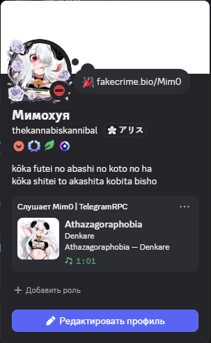
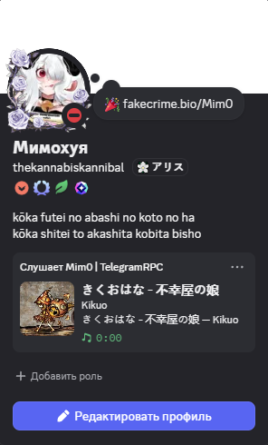
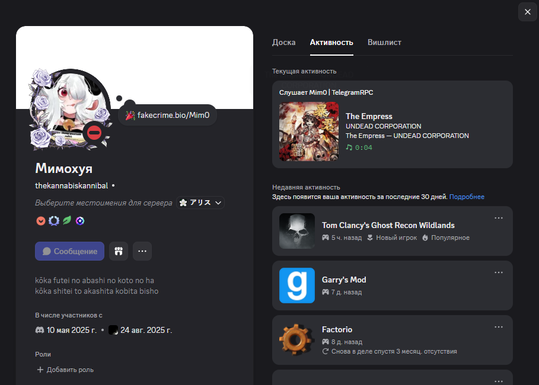
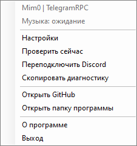
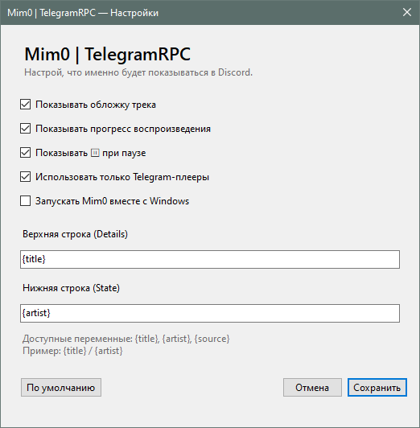

# Mim0 | TelegramRPC

**Windows music → Discord Rich Presence**

Mim0 is a lightweight Windows tray application that reads Windows Media Session metadata and publishes the currently playing track to Discord Rich Presence.

It was originally built around Telegram music, but it can also work with other compatible Windows Media Session players.

## ✨ Features

- 🎵 Track title and artist
- 🖼️ Dynamic album art
- ⏱️ Live playback progress
- ⏸️ Pause state
- 🔄 Automatic track switching
- 🔌 Automatic Discord reconnect
- 🔎 Telegram / AyuGram / ExteraGram detection
- 🌐 Optional support for other Windows Media Session players
- ⚙️ Custom Rich Presence templates
- 🔔 System tray controls
- 🧰 Built-in diagnostics for GitHub issues
- 🚀 Optional Windows startup
- 📦 Portable build + Inno Setup installer
- 🌍 Russian and English UI

## 🖼️ Screenshots

Mim0 shows the currently playing music in your Discord profile, including the track title, artist, album art and playback progress.

### Discord Rich Presence

<p align="center">
  
  
</p>

### Discord activity details

<p align="center">
  
</p>

### System tray

<p align="center">
  
</p>

### Settings

<p align="center">
  
</p>

## 🖥️ Requirements

- Windows 10/11 x64
- Discord Desktop
- Telegram, AyuGram, ExteraGram, or another player exposing Windows Media Session

The release build is self-contained, so you do **not** need to install .NET 8.

## 📥 Download

Open **Releases** and download either:

- `Mim0-TelegramRPC-vX.Y.Z-win-x64.zip` — portable version
- `Mim0.TelegramRPC.Setup.exe` — Windows installer

## ⚙️ Settings

Right-click the tray icon and open **Settings**.

Available options:

- Show/hide album art
- Show/hide playback progress
- Show paused state
- Telegram-only mode or all compatible Windows Media Sessions
- Start with Windows
- Custom Details and State templates
- Russian / English interface

Supported placeholders:

```text
{title}
{artist}
{source}
```

Example:

```text
Details: {title}
State: 🎧 {artist}
```

Settings are stored in:

```text
%APPDATA%\Mim0\TelegramRPC\settings.json
```

## 🎮 Discord setup

Mim0 uses a public Discord Application ID embedded in the source. It is **not a bot token or secret**.

For the fallback image, the Discord application should contain a Rich Presence asset with the exact key:

```text
default
```

Keep **Discord Desktop** running while testing.

## 🖼️ Album art and privacy

Windows Media Session may expose a track thumbnail. Discord Rich Presence cannot use an arbitrary local file as an external image, so Mim0 temporarily uploads the thumbnail to Litterbox when album art is enabled.

- Only the current cover is uploaded.
- Files are requested to expire after one hour.
- No Telegram messages, chats, contacts or audio are uploaded.
- Album art can be disabled in Settings.

## 🛠️ Build from source

Requires the **.NET 8 SDK** and Windows.

```text
build.bat
```

Or:

```powershell
dotnet restore TelegramDiscordRPC.csproj
dotnet publish TelegramDiscordRPC.csproj -c Release -r win-x64 --self-contained true -p:PublishSingleFile=true
```

## 🤖 GitHub Actions

Pushing to `main` runs a Windows build check.

Pushing a tag such as `v1.5.0` builds the portable ZIP and installer and publishes both files to a GitHub Release automatically.

## 🐛 Troubleshooting

### RPC does not appear

1. Make sure Discord Desktop is running.
2. Start Mim0.
3. Start a track in Telegram or another supported player.
4. Wait a few seconds.
5. Right-click the tray icon → **Check now**.
6. If necessary, use **Reconnect Discord**.

### Telegram is playing but Mim0 sees nothing

Make sure **Use Telegram players only** is enabled. If your Telegram client exposes a different Windows Media Session identifier, disable that option to test all compatible sessions.

### Need a bug report

Use the tray menu → **Copy diagnostics**, then paste the result into a GitHub Issue. Do not paste personal data or private tokens.

## 📁 Project structure

```text
Mim0-TelegramRPC/
├── .github/workflows/ci-release.yml
├── docs/screenshots/
├── Localization.cs
├── Program.cs
├── Settings.cs
├── SettingsForm.cs
├── TelegramDiscordRPC.csproj
├── installer.iss
├── build.bat
└── README.md
```

## 📜 License

This project is distributed under the license in `LICENSE`. It allows personal and non-commercial use; redistribution and commercial use are restricted without permission from Mim0.

## 👤 Author

**Mim0**

GitHub: https://github.com/TheKannabisKannibal/Mim0-TelegramRPC
